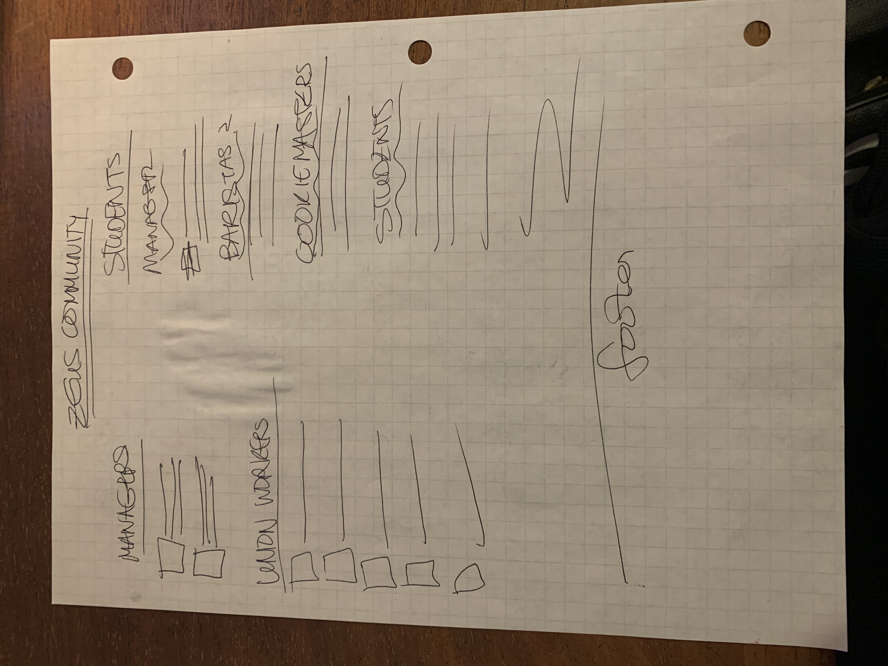

# Project 1: Design Journey

Be clear and concise in your writing. Bullets points are encouraged.

**Everything, including images, must be visible in Markdown Preview.** If it's not visible in Markdown Preview, then we won't grade it. We won't give you partial credit either. This is your warning.

## Existing Design, Planning, & Refined Design (Milestone 1)

### Existing Site: Target Audience I (Milestone 1)
> Who is your _existing_ site's target audience?

The website's target audience are students, faculty, and employees loyal to Zeus's business for its locally sourced ingredients and unique space for good meals, coffee, and conversation at Cornell. These customers have visited Zeus once or many times before and will be using the website to learn more about the café, its story, and the rotating menu so they can plan their next visit for when their favorite soup or beverage is offered.

### Existing Site: Target Audience I Needs (Milestone 1)
> Document your existing site's target audience's needs.
> List each need below. There is no specific number of needs required for this, but you need enough to do the job.

- Need #1: Menu
  - **Need**
    - > Reminders and updates of the contents of the full menu and the featured soups and beverages of the week and season.
  - **Design Choices**
    - > Put the menu on the home page, since that is the first reason most people are attracted to Zeus.
- Need #2: Information on Zeus's Community History and How to Get Involved
  - **Need**
    - > Knowledge of the hiring process at Zeus.
  - **Design Choices**
    - > Mix together the history of zeus and information about its current state (who works there, their roles, and why there is no application for student jobs).
- Need #3: Sustainability Initiative, Ingredient Information, and Pricing
  - **Need**
    - > Details that clarify why some purchases at Zeus seem expensive, the deals that are available when you eat at the cafe with reuseable dishes or bring your own, and list of local ingredient sources with links to their respective websites.
  - **Design Choices**
    - > Blurb expunging the claims made by bad press in the past, real information about Zeus's status as a nonprofit and behind the scenes of funding the café and serving high quality products.

### Existing Site: Design/Sketches (Milestone 1)
> Sketch your existing site. Include these sketches here.
> DO NOT COPY SKETCHES FROM THE ORIGINAL ASSIGNMENT! Create new sketches here. This is part of the design process to get you thinking about the strengths/weaknesses of the current design.
> Provide a brief explanation _underneath_ each sketch.


On each of these pages, there is a sort of hero image above the nav bar that appears in a different size and not very good quality on every page, a design choice that lends an inconsistent appearance to the website and also hides the nav bar depending on the size of the window in whcih the viewer is looking at the page. I definitely will be changing that around. It also only has the soups for that week while the rest of the menu is stored on a different page, which could confuse customers.


This page is a little bit sparse, with only a small paragraph giving some background information about the café and a few links to news articles in which zeus is featured. This page should be bulked up and the links put in the correct order by date, or showcased differently entirely in a manner more conducive to putting useful information directly onto the page instead of requiring people to visit other pages to see it.


The title of this page in the nav bar is different from the title displayed at the top of the page when you navigate to it, same as on some of the other pages, which might make people think they've gone to a different point on the site than they intended to. The formatting of the menu isn't great, since it's left-oriented, but some lines stretch out much farther to the right than others, giving it a strangely stretched look.


This page's title is also different in the nav bar and on the actual page itself, which should be modified. Also similar to the menu page, it has a lot of lists, this time not of ingredients but of employees, all oriented to the left side of the page so that the page is very long but doesn't use a lot of space to the right of those lists. Instead, there should be multiple columns, and possibly photos of some of the employees to make the page look more interesting.


### Refined Site: Target Audience II (Milestone 1)
> Who is your additional/secondary target audience?

The secondary target audience of the site will be interested parties who are not returning customers of Temple of Zeus. They will either be a company for some kind of food product looking to partner with Zeus and have their goods sold at the café, an organization or group looking to inquire about Zeus's catering services, or a journalism entity trying to contact the café for information or quotes for a news story.

### Refined Site: Target Audience II Needs (Milestone 1)
> Document target audience II's needs.
> List each need below. There is no specific number of needs required for this, but you need enough to do the job.

- Need #1: Contact Information
  - **Need**
    - > Information about how to contact the managers about business requests/statements
  - **Design Ideas and Choices**
    - > Include this in the footer so it is easy to find and available on every page of the website.
- Need #2: Catering Requests
  - **Need**
    - > Info about the scale of catering Zeus performs and whether it's possible to request their services
  - **Design Ideas and Choices**
    - > Form for advanced order requests, include option "New Account" in drop-down menu of accounts
- Need #3: Information about ownership, partnership, and pricing
  - **Need**
    - > Logistical information about how the café is run, either for reporting or so groups interested in partnering can see how that process works at Zeus.
  - **Design Ideas and Choices**
    - > Fold this in with the information about sustainability intiatives and pricing of interest to regular customers.


### Refined Site: Content Organization/Navigation (Milestone 1)
> Identify the content that is necessary for both target audiences.
> List the content here.
> Don't forget to include the form.

- Home/Menu page (pastries, cookies, breakfast sandwiches, lunch sandwiches, chips, rolls, soups, soup accompaniment, coffee and espresso drinks, steamers and tea, bottled beverages, kombucha on tap, snack food...)
- Advance Order Form
- Zeus Community page (employment info)
- Backstory page (ingredient sourcing/pricing)
- Blurb about ownership and partnership (Cornell College of Arts and Sciences, café leadership, Gimme, Macro Mama, Ithaca Bakery...)
- List of managers
- List of union employees
- List of student workers, special roles distinguished (baristas, cookie masters, student managers)
- Café address (make a nicer header)
- Nav bar
- Photos and captions/citations
- link to old website (include soups and ingredients that are on there?)
- news links
- footer
- social media
- payment methods

> Organize the content for the target audience and identify possible pages for the content using card sorting.
> First, organize the content for target audience I. Document your card sorting by taking a photo and including it here.


This setup would appeal to people who are already loyal customers, with one page about the people who work at Zeus, a second page where people can find information about Zeus's history, appearances in the news, and open hours, and a third page with the full menu, including rotating featured menu items, as well as payment methods accepted at the café, information about pricing of the menu items, and a form for catering and other account requests.


> Second, organize the content for target audience II. Document your card sorting by taking a photo and including it here.


This second setup might be better for people more interested in the business side of things at Zeus than the customer service. Employment info appears at the top of the employment information page as an overview, and the catering an infromation request forms are featured together on a more logistics-oriented page while the news articles are under the payment information since some of them correspond to stories about Zeus's pricing. The footer at the bottom remains the same for the two.

> Next, organize the content for both target audiences. Document your card sorting by taking a photo and including it here.


> Lastly, list the pages that resulted from your final card sort (i.e. your site's navigation).

- Menu (Home)
- Zeus Community
- About Us
- Pricing & Accounts

### Refined Site: Design (Milestone 1)
> Refine the design of your site to meet the needs of _both_ target audiences.
> Include sketches of each page of the refined design.
> Provide a brief explanation _underneath_ each sketch.
> Document your _entire_ design process. **Show your preliminary sketches and your final sketches.**
> Don't forget the form and confirmation page!





### Partial Plan (Milestone 1)
> Using your refined sketches, plan your site's partials.
> You may describe each partial or sketch it. It's up to you!

- header: Temple of Zeus logo, short description
- head: meta, tab page title, style sheet
- footer: contact info, café address, link to old website, short blurb about payment options (deciding to move job opportunities to community page since interested parties will likely look there first.)
- nav bar: links to all pages, page title

---

## Sticky Form Planning (Milestone 2)

### Sticky Form (Milestone 2)
> What controls do you need for your form?

select, email, phone, date, time, textarea, submit.

> Plan out your feedback messages for your form. You may sketch (probably the easiest) or write it out.

Order Form: Account (required), Email (required) Date (required), Pickup Time (required), Order Details/Request (required).


> How does this form meet the needs of at least one of your target audiences (specify which)?
This form will suit the needs of both target audiences: the first, returning customers, potentially includes customers who already have an account set up with the cafe and may even regularly place orders for events. The second, customers who aren't familiar with Zeus but may have commercial interest in them, might like to use the form to cater to events outside of the Cornell community, and the fact that the form is available will on its own tell them more about Zeus and the fact that its on-campus presence includes a small catering function for student and faculty events.

### Validation Code Plan (Milestone 2)
> Write out your pseudocode plan for handling the validation of the form.

```
When the user tries to submit the form:
    If Account's HTML5 validation criteria has not been met:
        Show a feedback message to "Please select the account to be charged or select "Create New Account.""
        Do not submit the form.
    If Email's HTML5 validation criteria has not been met:
        Show a feedback message to "Please enter a valid email address."
        Do not submit the form.
    If Phone's HTML5 validation criteria has not been met:
        Show a feedback message to "Please enter a phone number in case we need to contact you."
        Do not submit the form.
    If Date's HTML5 validation criteria has not been met:
        Show a feedback message to "Please select the date for when the order should be filled."
        Do not submit the form.
    If Pickup Time's HTML5 validation criteria has not been met:
        Show a feedback message to "Please select a time during open hours (7:30 AM-6:00 PM)."
        Do not submit the form.
    If Request's HTML5 validation criteria has not been met:
        Show a feedback message to "Please let us know what you'd like to order."
        Do not submit the form.
    Otherwise,
        Show no feedback messages.
        Submit the form to the server.
```

---

## Complete & Polished Website (Final Submission)

### Target Audiences (Final Submission)
> Tell us how your final site meets the needs of the target audiences. Be specific here. Tell us how you tailored your design, content, etc. to make your website usable by both target audiences.
The website is simple, professional, and warm. These qualities cater to both audiences by setting the tone of the cafe as a place where business takes place and the brand is respected, but also as an approachable, homey space where students, faculty, and Ithacans may have a nice meal and relax. The color scheme matches the tones of the physical space, appeaing to those who have visited before and conveying the atmosphere to those unfamiliar with the cafe. Outside companies potentially interested in doing business with Zeus will thus feel as though they already know the place when they visit after having viewed the website, and will me more amenable to business arrangements. Journalists interested in covering stories concerning the cafe will have the same experience, and will be easily able to find answers to a multitude of their questions on the website just by navigating the four clearly labeled pages of the site. Anyone unfamiliar with Zeus's location can find it on the map from any of the pages just by glancing at the header, and more detailed directions specifying the possible building entrances from which to find Zeus are listed on the About page, right at the top.

### Additional Design Justifications (Final Submission)
> If you feel like you haven’t fully explained your design choices in the final submission, or you want to explain some functions in your site (e.g., if you feel like you make a special design choice which might not meet the final requirement), you can use the additional design justifications to justify your design choices. Remember, this is place for you to justify your design choices which you haven’t covered in the design journey. You don’t need to fill out this section if you think all design choices have been well explained in the design journey.

I chose not to include the soup recipes, as I had initially planned in my cardsorting, after discussing this at work and hearing from my boss that he'd rather not have them listed on this site. I also left out the information request form since that kind of form is not realistically used, and I combined the account creatio form with the order form since all that it takes to create an account is to email the provided email or select that you want to do so from the drop down bar as you're putting in an order.


### Self-Reflection (Final Submission)
> Reflect on what you learned during this assignment. How have you improved from 1300? What things did you have trouble with?

I've definitely improved from 1300--PHP partials make keeping track of repeating content so much easier! I also had less trouble with CSS this time around, though I would still like to learn more about how to more efficiently design aethetically pleasing websites. And unfortunately, I still haven't gotten the whole submission thing down (hence the points loss from M1)... But we're working on that.
